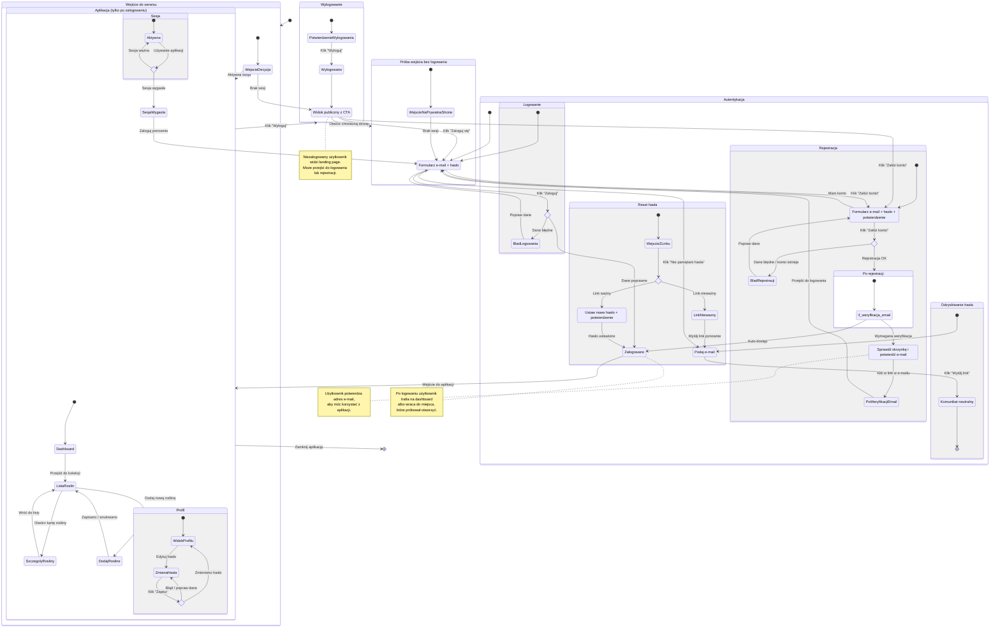

# Diagram podróży użytkownika — logowanie i rejestracja

<user_journey_analysis>
## 1) Ścieżki użytkownika (z PRD + auth-spec)

- Korzystanie jako **niezalogowany**:
  - wejście na landing page
  - próba wejścia do aplikacji (np. dashboard / kolekcja roślin) → przekierowanie do logowania
- **Logowanie** (e-mail + hasło):
  - logowanie z landingu
  - logowanie po przekierowaniu z chronionej podstrony (powrót do miejsca, z którego user przyszedł)
  - błąd logowania → komunikat
- **Rejestracja** (e-mail + hasło + potwierdzenie hasła):
  - poprawna rejestracja → dostęp do aplikacji
  - (wariant) wymagane potwierdzenie e-mail → user weryfikuje adres i dopiero wtedy uzyskuje dostęp
  - błąd rejestracji (np. konto istnieje, walidacja) → komunikat
- **Odzyskiwanie hasła**:
  - wysłanie linku resetu (komunikat neutralny)
  - wejście z linku i ustawienie nowego hasła
  - brak/nieaktualny link → ponowne wysłanie
- **Zmiana hasła** (w aplikacji, z podaniem aktualnego hasła)
- **Wylogowanie** (z headera aplikacji)

## 2) Główne podróże i stany

- Public:
  - Landing (CTA do logowania/rejestracji)
  - Strony autentykacji (logowanie / rejestracja / odzyskiwanie / reset)
- Private:
  - Aplikacja (dashboard, lista roślin, szczegóły rośliny, profil)
  - Sesja wygasła (powrót do logowania)

## 3) Punkty decyzyjne i alternatywne ścieżki

- Czy użytkownik ma aktywną sesję?
  - tak → automatyczne przejście do aplikacji
  - nie → landing lub strony auth (zależnie od wejścia)
- Czy dane formularza są poprawne?
  - tak → przejście dalej
  - nie → komunikaty i poprawki w formularzu
- Czy po rejestracji wymagane jest potwierdzenie e-mail?
  - tak → stan “Sprawdź e-mail” + przejście po weryfikacji
  - nie → bezpośredni dostęp do aplikacji
- Czy link resetu hasła jest ważny?
  - tak → ustaw nowe hasło
  - nie → poproś o wysłanie linku ponownie

## 4) Krótki opis celu każdego stanu (high-level)

- Landing: wyjaśnia wartość aplikacji i prowadzi do logowania/rejestracji.
- Formularz logowania: umożliwia powrót do aplikacji (lub do miejsca, które user próbował otworzyć).
- Formularz rejestracji: pozwala utworzyć konto do prywatnej aplikacji.
- Sprawdź e-mail: instruuje użytkownika, by potwierdził adres (jeśli wymagane).
- Formularz odzyskiwania: pozwala poprosić o link resetu hasła.
- Formularz resetu: pozwala ustawić nowe hasło.
- Aplikacja: prywatna część z dashboardem i kolekcją roślin.
- Profil: umożliwia zmianę hasła.
- Wylogowano: kończy sesję i przenosi na publiczny landing.
</user_journey_analysis>

<mermaid_diagram>

</mermaid_diagram>
