<architecture_analysis>
## Cel diagramu
Zwizualizowanie docelowej architektury UI (Astro pages + layouty + React komponenty) dla modułu autentykacji (logowanie, rejestracja, odzyskiwanie i zmiana hasła) oraz powiązań z resztą aplikacji (dashboard / rośliny).

## Komponenty i moduły z dokumentacji (PRD + auth-spec)
- Layouty:
  - `src/layouts/Layout.astro` (public + auth)
  - `src/layouts/AppLayout.astro` (app shell)
  - (opcjonalnie) `src/layouts/AuthLayout.astro`
- Strony Astro (docelowe):
  - Public: `src/pages/index.astro` (landing), `GET /`
  - Auth: `src/pages/auth/login.astro`, `register.astro`, `forgot-password.astro`, `reset-password.astro`, `callback.astro`
  - Private: `src/pages/app/dashboard.astro`, `src/pages/app/plants.astro`, `src/pages/app/plants/new.astro`, `src/pages/app/plants/[id].astro`, `src/pages/app/profile.astro`
- Komponenty React (docelowe, `src/components/auth/`):
  - `LoginForm.tsx`, `RegisterForm.tsx`
  - `ForgotPasswordForm.tsx`, `ResetPasswordForm.tsx`
  - `ChangePasswordForm.tsx`
  - (opcjonalnie) `AuthFormShell.tsx`
- Komponenty UI (docelowe, auth w headerze):
  - (rekomendacja) `src/components/auth/AuthButton.astro` (SSR-friendly przycisk/link)
  - (opcjonalnie) `src/components/auth/LogoutButton.tsx` (client-side logout)
- Lib/services (docelowe):
  - `src/lib/auth/auth-client.ts` (wrapper do `/api/auth/*`)
  - `src/lib/auth/redirect.ts` (walidacja `redirectTo`, “relative-only”)
  - `src/lib/auth/auth-errors.ts` (mapowanie błędów do UX)
- Backend (docelowe):
  - `src/pages/api/auth/*` (login/register/logout/forgot/reset/change-password)
  - “guard” w `src/middleware/index.ts` (blokada `/app/*` i `/api/*` poza `/api/auth/*`)
  - `src/db/supabase.server.ts` (server client z cookies)
  - RLS w Supabase (izolacja danych per `user_id`)

## Elementy znalezione w codebase (już istnieją i wpływają na auth)
- Layouty i app shell:
  - `src/layouts/Layout.astro` (obecnie tylko logo + slot)
  - `src/layouts/AppLayout.astro` (header + `AppTopNav` + `AppBottomNav` + `AppFooter`, brak logout)
- Strony `/app/*`:
  - `src/pages/app/dashboard.astro` → `DashboardView` (React)
  - `src/pages/app/plants.astro` → `PlantsListView` (React)
  - `src/pages/app/plants/new.astro` → `NewPlantView` (React) **(używa Layout.astro)**
  - `src/pages/app/plants/[id].astro` → `PlantView` (React) **(używa Layout.astro)**
  - `src/pages/app/index.astro` → redirect do `/app/dashboard`
- Komponenty app:
  - `src/components/app/AppTopNav.astro`, `AppBottomNav.astro`, `AppFooter.astro`
  - `src/lib/navigation/app-nav.ts` (definicja menu)
- “Stan auth” w warstwie UI (React):
  - hooki (`useDashboardData`, `usePlantsData`, `usePlantDetailData`, `useCreatePlant`) ustawiają `authRequired` na podstawie `401`
  - widoki (`DashboardView`, `PlantsListView`, `PlantView`, `NewPlantView`, `PlantCard`) robią redirect: `/auth/login?redirectTo=...`
- Warstwa API client:
  - `src/lib/api/api-client.ts` używa `credentials: "include"` (cookies sesji)
- Backend:
  - `src/middleware/index.ts` tylko wstrzykuje `context.locals.supabase` (bez sesji/guardów)
  - API routes używają `DEFAULT_USER_ID` z `src/db/supabase.client.ts` (do zastąpienia sesją)

## Główne strony i odpowiadające komponenty
- Public:
  - `/` → landing (CTA do `/auth/login` / `/auth/register`)
- Auth:
  - `/auth/login` → `LoginForm`
  - `/auth/register` → `RegisterForm`
  - `/auth/forgot-password` → `ForgotPasswordForm`
  - `/auth/callback` → wymiana `code` na sesję (cookies)
  - `/auth/reset-password` → `ResetPasswordForm`
- Private:
  - `/app/dashboard` → `DashboardView` (React) + hook `useDashboardData` → `/api/dashboard`
  - `/app/plants` → `PlantsListView` + hook `usePlantsData` → `/api/plants`
  - `/app/plants/new` → `NewPlantView` + hook `useCreatePlant` → `/api/plants`
  - `/app/plants/:id` → `PlantView` + hook `usePlantDetailData` → `/api/plants/:id`
  - `/app/profile` → `ChangePasswordForm` → `/api/auth/change-password`

## Przepływ danych (skrót)
- React (form) → `src/lib/auth/auth-client.ts` → `POST /api/auth/*` → Supabase Auth (server) → cookies sesji → redirect do `/app/*`
- React (widoki danych) → `src/lib/api/api-client.ts` (`credentials: include`) → `GET /api/*` → API routes używają `context.locals.supabase` + user z sesji → `ApiResponseDto<T>`
- Brak sesji:
  - `/app/*` (HTML) → middleware: redirect 302 do `/auth/login?redirectTo=...`
  - `/api/*` → middleware/API: `401` → hook ustawia `authRequired` → UI robi redirect do login

## Funkcjonalność komponentów (krótko)
- Layouty:
  - `Layout.astro`: nagłówek public/auth + linki logowania/rejestracji (prawy górny róg)
  - `AppLayout.astro`: app shell + nawigacja + przycisk wylogowania (prawy górny róg)
- Formy auth:
  - `LoginForm`: logowanie e-mail/hasło + toast + redirect
  - `RegisterForm`: rejestracja e-mail/hasło/potwierdzenie + auto-login + toast
  - `ForgotPasswordForm`: wysyłka linku (komunikat sukcesu niezależnie od istnienia konta)
  - `ResetPasswordForm`: ustawienie nowego hasła w sesji recovery
  - `ChangePasswordForm`: zmiana hasła z podaniem aktualnego hasła
- Middleware i sesja:
  - `src/middleware/index.ts`: tworzy per-request Supabase server client, odczytuje usera z cookies, egzekwuje reguły dostępu

```mermaid
flowchart TD
  %% === Style ===
  classDef new fill:#e7f5ff,stroke:#1c7ed6,stroke-width:1px;
  classDef updated fill:#fff3cd,stroke:#f08c00,stroke-width:1px;
  classDef existing fill:#f1f3f5,stroke:#495057,stroke-width:1px;

  %% === Routing & Layouts (Astro) ===
  subgraph ROUTING["Routing i layouty — Astro"]
    R_PUBLIC["Strefa publiczna"]:::existing
    R_AUTH["Strefa autentykacji"]:::new
    R_APP["Strefa aplikacji"]:::existing

    LAYOUT_Public["Layout.astro — public/auth"]:::updated
    LAYOUT_App["AppLayout.astro — app shell"]:::updated
    LAYOUT_Auth["AuthLayout.astro — opcjonalny"]:::new
  end

  %% Public pages
  subgraph PUBLIC_PAGES["Public — strony i CTA"]
    P_Landing["Landing"]:::existing
    UI_PublicHeader["Nagłówek public — logo + CTA auth"]:::updated
  end

  %% Auth pages
  subgraph AUTH_PAGES["Moduł autentykacji — strony Astro"]
    P_Login["Strona logowania"]:::new
    P_Register["Strona rejestracji"]:::new
    P_Forgot["Strona odzyskiwania hasła"]:::new
    P_Reset["Strona ustawienia nowego hasła"]:::new
    P_Callback["Strona callback autentykacji"]:::new
  end

  %% App pages
  subgraph APP_PAGES["Aplikacja — strony Astro"]
    P_Dashboard["Strona dashboardu"]:::existing
    P_Plants["Strona listy roślin"]:::existing
    P_PlantNew["Strona dodania rośliny"]:::updated
    P_PlantDetail["Strona szczegółów rośliny"]:::updated
    P_Profile["Strona profilu"]:::new
  end

  %% === React UI ===
  subgraph REACT_AUTH["UI Auth — React"]
    C_LoginForm["LoginForm"]:::new
    C_RegisterForm["RegisterForm"]:::new
    C_ForgotForm["ForgotPasswordForm"]:::new
    C_ResetForm["ResetPasswordForm"]:::new
    C_ChangePassword["ChangePasswordForm"]:::new
    C_AuthShell["AuthFormShell (opcjonalny)"]:::new
  end

  subgraph REACT_APP["UI App — React"]
    C_DashboardView["DashboardView"]:::existing
    C_PlantsListView["PlantsListView"]:::existing
    C_NewPlantView["NewPlantView"]:::existing
    C_PlantView["PlantView"]:::existing
  end

  %% === App shell components ===
  subgraph APP_SHELL["App shell — Astro komponenty"]
    C_TopNav["AppTopNav.astro"]:::existing
    C_BottomNav["AppBottomNav.astro"]:::existing
    C_Footer["AppFooter.astro"]:::existing
    C_AuthButton["AuthButton.astro — login/logout"]:::new
    C_LogoutButton["LogoutButton — opcjonalny"]:::new
  end

  %% === State & Fetch ===
  subgraph CLIENT_STATE["Stan i pobieranie danych — client"]
    S_ApiClient["api-client.ts — cookies w fetch"]:::existing
    S_AuthClient["auth-client.ts"]:::new
    S_Redirect["redirect.ts — walidacja redirectTo"]:::new
    S_AuthRequired["Mechanizm authRequired"]:::existing
  end

  %% === Middleware & Server auth ===
  subgraph SERVER_AUTH["Sesja i guard — server"]
    M_Middleware["middleware/index.ts — Supabase SSR + guard"]:::updated
    DB_ServerClient["supabase.server.ts — server client + cookies"]:::new
    DB_Supabase["Supabase — Auth + DB + RLS"]:::existing
  end

  %% === API routes ===
  subgraph API["API — Astro API routes"]
    API_Auth["API autentykacji"]:::new
    API_Data["API danych aplikacji"]:::updated
  end

  %% === Relationships: routing to layouts ===
  R_PUBLIC --> LAYOUT_Public
  R_AUTH --> LAYOUT_Public
  R_APP --> LAYOUT_App
  LAYOUT_Auth -.-> LAYOUT_Public

  %% === Relationships: pages to UI ===
  LAYOUT_Public --> UI_PublicHeader
  LAYOUT_Public --> P_Landing
  LAYOUT_Public --> P_Login
  LAYOUT_Public --> P_Register
  LAYOUT_Public --> P_Forgot
  LAYOUT_Public --> P_Reset
  LAYOUT_Public --> P_Callback

  LAYOUT_App --> C_TopNav
  LAYOUT_App --> C_BottomNav
  LAYOUT_App --> C_Footer
  LAYOUT_App --> C_AuthButton
  C_AuthButton -.-> C_LogoutButton

  %% === Auth pages embed React forms ===
  P_Login --> C_LoginForm
  P_Register --> C_RegisterForm
  P_Forgot --> C_ForgotForm
  P_Reset --> C_ResetForm
  P_Profile --> C_ChangePassword
  C_AuthShell -.-> C_LoginForm
  C_AuthShell -.-> C_RegisterForm
  C_AuthShell -.-> C_ForgotForm
  C_AuthShell -.-> C_ResetForm

  %% === App pages embed React views ===
  P_Dashboard --> C_DashboardView
  P_Plants --> C_PlantsListView
  P_PlantNew --> C_NewPlantView
  P_PlantDetail --> C_PlantView

  %% === Client calls ===
  C_LoginForm --> S_AuthClient
  C_RegisterForm --> S_AuthClient
  C_ForgotForm --> S_AuthClient
  C_ResetForm --> S_AuthClient
  C_ChangePassword --> S_AuthClient
  S_AuthClient --> API_Auth

  C_DashboardView --> S_ApiClient
  C_PlantsListView --> S_ApiClient
  C_NewPlantView --> S_ApiClient
  C_PlantView --> S_ApiClient
  S_ApiClient --> API_Data

  %% === 401 handling (existing behavior) ===
  API_Data -- "401" --> S_AuthRequired
  S_AuthRequired -- "przekierowanie do logowania" --> R_AUTH
  S_Redirect -.-> S_AuthClient

  %% === Server guard + session ===
  M_Middleware --> DB_ServerClient
  DB_ServerClient --> DB_Supabase
  M_Middleware -- "guard HTML: przekierowanie do logowania" --> R_AUTH
  M_Middleware -- "guard API: 401" --> API_Data
  API_Auth --> DB_Supabase
  API_Data --> DB_Supabase
```

</architecture_analysis>

<mermaid_diagram>

</mermaid_diagram>
